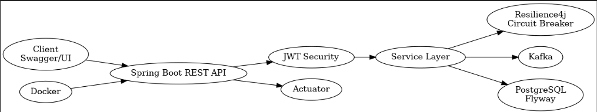
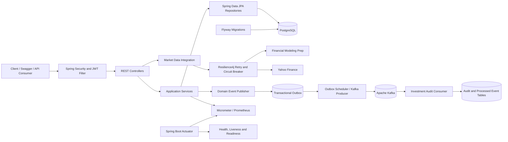
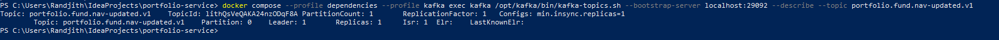
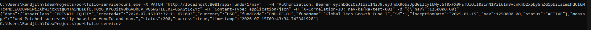

# Portfolio Service

## 1. Project Overview

`portfolio-service` is a Java 21 and Spring Boot–based backend service for managing private-equity funds, investors,
investments, portfolio summaries, market-price retrieval, and event-driven investment auditing.

The application demonstrates:

- RESTful API design
- JWT authentication and role-based authorization
- Spring Data JPA and PostgreSQL
- Flyway database migrations
- Kafka publishing and consumption
- Transactional outbox processing
- Retry and dead-letter-topic handling
- Resilience4j retry and circuit breaker
- Spring Boot Actuator, health probes, Prometheus metrics, and custom metrics
- Docker multi-stage builds and Docker Compose orchestration
- Swagger/OpenAPI documentation
- Correlation-ID logging
- Unit and integration testing support

---

## 2. Technology Stack

| Area                | Technology                                                         |
|---------------------|--------------------------------------------------------------------|
| Language            | Java 21                                                            |
| Framework           | Spring Boot                                                        |
| API                 | Spring MVC, REST, OpenAPI/Swagger                                  |
| Security            | Spring Security, JWT, role-based authorization                     |
| Database            | PostgreSQL 17                                                      |
| Persistence         | Spring Data JPA, Hibernate                                         |
| Database migrations | Flyway                                                             |
| Messaging           | Apache Kafka                                                       |
| Resilience          | Resilience4j Retry and Circuit Breaker                             |
| Observability       | Actuator, Micrometer, Prometheus, custom health and metrics        |
| Build               | Maven / Maven Wrapper                                              |
| Testing             | JUnit 5, Mockito, Spring Security Test, Kafka Test, Testcontainers |
| Deployment          | Docker, Docker Compose                                             |

## 3. Architecture

See `portfolio_architecture.png`.




---

## 4. Default URLs

The default application port is `8081`.

| Resource             | URL                                               |
|----------------------|---------------------------------------------------|
| Application base URL | `http://localhost:8081`                           |
| Swagger UI           | `http://localhost:8081/swagger-ui.html`           |
| OpenAPI JSON         | `http://localhost:8081/v3/api-docs`               |
| OpenAPI YAML         | `http://localhost:8081/v3/api-docs.yaml`          |
| Actuator base        | `http://localhost:8081/actuator`                  |
| Health check         | `http://localhost:8081/actuator/health`           |
| Liveness probe       | `http://localhost:8081/actuator/health/liveness`  |
| Readiness probe      | `http://localhost:8081/actuator/health/readiness` |
| Prometheus metrics   | `http://localhost:8081/actuator/prometheus`       |

> `/api/auth/login`, Swagger resources, OpenAPI resources, and `/actuator/health` are public. Other business APIs
> require a JWT. Most Actuator endpoints require an `ADMIN` JWT.
 
---

## 5. Authentication and Authorization

### 5.1 Login

| Method | Endpoint          | Access |
|--------|-------------------|--------|
| `POST` | `/api/auth/login` | Public |

Example:

```bash
curl -X POST "http://localhost:8081/api/auth/login" \
  -H "Content-Type: application/json" \
  -d '{
    "username": "portfolio.admin",
    "password": "AdminPassword@2026"
  }'
```

Copy the `accessToken` from the response.

```bash
export TOKEN="<paste-access-token>"
```

Windows PowerShell:

```powershell
$TOKEN = "<paste-access-token>"
```

### 5.2 Register User

| Method | Endpoint             | Access  |
|--------|----------------------|---------|
| `POST` | `/api/auth/register` | `ADMIN` |

```bash
curl -X POST "http://localhost:8081/api/auth/register" \
  -H "Authorization: Bearer ${TOKEN}" \
  -H "Content-Type: application/json" \
  -d '{
    "username": "portfolio.manager",
    "password": "ManagerPassword@2026",
    "email": "manager@example.com",
    "role": "PORTFOLIO_MANAGER"
  }'
```

Available roles are defined by the application’s `UserRole` enum. The security configuration uses:

- `ADMIN`
- `PORTFOLIO_MANAGER`
- `ANALYST`
- `AUDITOR`
- `OPERATIONS_USER`

### 5.3 Using the JWT in Swagger

1. Open `http://localhost:8081/swagger-ui.html`.
2. Execute `POST /api/auth/login`.
3. Copy the returned access token.
4. Click **Authorize**.
5. Enter the token. Depending on the OpenAPI security scheme, use either the raw token or `Bearer <token>`.
6. Execute secured APIs.

---

## 6. Business API Endpoints

### 6.1 Authentication Service

| Method | Endpoint             | Purpose                      | Access  |
|--------|----------------------|------------------------------|---------|
| `POST` | `/api/auth/login`    | Authenticate and obtain JWT  | Public  |
| `POST` | `/api/auth/register` | Register an application user | `ADMIN` |

### 6.2 Fund Service

Base path: `/api/funds`

| Method   | Endpoint                     | Purpose               | Access                       |
|----------|------------------------------|-----------------------|------------------------------|
| `POST`   | `/api/funds`                 | Create a fund         | `ADMIN`, `PORTFOLIO_MANAGER` |
| `GET`    | `/api/funds/{fundId}`        | Retrieve one fund     | `ADMIN`, `PORTFOLIO_MANAGER` |
| `GET`    | `/api/funds`                 | Retrieve all funds    | `ADMIN`, `PORTFOLIO_MANAGER` |
| `PUT`    | `/api/funds/{fundId}`        | Replace/update a fund | `ADMIN`, `PORTFOLIO_MANAGER` |
| `PATCH`  | `/api/funds/{fundId}/nav`    | Update fund NAV       | `ADMIN`, `PORTFOLIO_MANAGER` |
| `PATCH`  | `/api/funds/{fundId}/status` | Update fund status    | `ADMIN`, `PORTFOLIO_MANAGER` |
| `DELETE` | `/api/funds/{fundId}`        | Delete a fund         | `ADMIN`, `PORTFOLIO_MANAGER` |

Create-fund example:

```bash
curl -X POST "http://localhost:8081/api/funds" \
  -H "Authorization: Bearer ${TOKEN}" \
  -H "Content-Type: application/json" \
  -d '{
    "fundCode": "PE-GROWTH-01",
    "fundName": "Private Equity Growth Fund I",
    "assetClass": "PRIVATE_EQUITY",
    "currency": "USD",
    "nav": 1000000.00,
    "inceptionDate": "2026-01-01",
    "status": "ACTIVE"
  }'
```

Update NAV example:

```bash
curl -X PATCH "http://localhost:8081/api/funds/1/nav" \
  -H "Authorization: Bearer ${TOKEN}" \
  -H "Content-Type: application/json" \
  -d '{"nav": 1050000.00}'
```

### 6.3 Investor Service

Base path: `/api/investors`

| Method   | Endpoint              | Purpose                                                                           | Access                       |
|----------|-----------------------|-----------------------------------------------------------------------------------|------------------------------|
| `POST`   | `/api/investors`      | Create an investor                                                                | `ADMIN`, `PORTFOLIO_MANAGER` |
| `GET`    | `/api/investors/{id}` | Retrieve one investor                                                             | `ADMIN`, `PORTFOLIO_MANAGER` |
| `GET`    | `/api/investors`      | Retrieve investors using pagination/search parameters supported by the controller | `ADMIN`, `PORTFOLIO_MANAGER` |
| `PUT`    | `/api/investors/{id}` | Update an investor                                                                | `ADMIN`, `PORTFOLIO_MANAGER` |
| `DELETE` | `/api/investors/{id}` | Delete an investor                                                                | `ADMIN`, `PORTFOLIO_MANAGER` |

Create-investor example:

```bash
curl -X POST "http://localhost:8081/api/investors" \
  -H "Authorization: Bearer ${TOKEN}" \
  -H "Content-Type: application/json" \
  -d '{
    "investorCode": "INV-001",
    "name": "Sample Institutional Investor",
    "email": "investor@example.com",
    "country": "Singapore",
    "riskProfile": "MODERATE",
    "committedAmount": 5000000.00
  }'
```

### 6.4 Investment Service

Base path: `/api/investments`

| Method  | Endpoint                                 | Purpose                              | Access                                          |
|---------|------------------------------------------|--------------------------------------|-------------------------------------------------|
| `POST`  | `/api/investments`                       | Create an investment                 | `ADMIN`, `PORTFOLIO_MANAGER`, `OPERATIONS_USER` |
| `GET`   | `/api/investments/{id}`                  | Retrieve one investment              | Same roles                                      |
| `GET`   | `/api/investments`                       | Retrieve investments                 | Same roles                                      |
| `GET`   | `/api/investments/investor/{investorId}` | Retrieve investments for an investor | Same roles                                      |
| `GET`   | `/api/investments/fund/{fundId}`         | Retrieve investments for a fund      | Same roles                                      |
| `PATCH` | `/api/investments/{id}/status`           | Update investment status             | Same roles                                      |

Creating an investment triggers the investment-created domain-event flow.

```bash
curl -X POST "http://localhost:8081/api/investments" \
  -H "Authorization: Bearer ${TOKEN}" \
  -H "Content-Type: application/json" \
  -d '{
    "investorId": 1,
    "fundId": 1,
    "amount": 250000.00
  }'
```

Update investment status:

```bash
curl -X PATCH "http://localhost:8081/api/investments/1/status" \
  -H "Authorization: Bearer ${TOKEN}" \
  -H "Content-Type: application/json" \
  -d '{"status": "APPROVED"}'
```

### 6.5 Portfolio Service

Base path: `/api/portfolios`

| Method | Endpoint                                        | Purpose                                 | Access                                             |
|--------|-------------------------------------------------|-----------------------------------------|----------------------------------------------------|
| `GET`  | `/api/portfolios/investor/{investorId}/summary` | Return the investor’s portfolio summary | `ADMIN`, `PORTFOLIO_MANAGER`, `ANALYST`, `AUDITOR` |

```bash
curl "http://localhost:8081/api/portfolios/investor/1/summary" \
  -H "Authorization: Bearer ${TOKEN}"
```

### 6.6 Market Data Integration Service

Base path: `/api/market-data`

| Method | Endpoint                           | Purpose                          | Access             |
|--------|------------------------------------|----------------------------------|--------------------|
| `GET`  | `/api/market-data/prices/{symbol}` | Retrieve the latest market price | Authenticated user |

```bash
curl "http://localhost:8081/api/market-data/prices/AAPL" \
  -H "Authorization: Bearer ${TOKEN}"
```

The integration uses configured market-data providers and applies Resilience4j retry and circuit-breaker policies.

---

## 7. Actuator, Health and Metrics Endpoints

Configured exposure:

```text
health, info, metrics, prometheus, flyway, loggers,
threaddump, scheduledtasks
```

| Endpoint                             | Purpose                                                  | Access                                         |
|--------------------------------------|----------------------------------------------------------|------------------------------------------------|
| `GET /actuator/health`               | Overall application health                               | Public                                         |
| `GET /actuator/health/liveness`      | Kubernetes/Docker liveness state                         | Usually `ADMIN` under current security matcher |
| `GET /actuator/health/readiness`     | Readiness including database and custom portfolio health | Usually `ADMIN` under current security matcher |
| `GET /actuator/info`                 | Application, Java, and operating-system information      | `ADMIN`                                        |
| `GET /actuator/metrics`              | List available metric names                              | `ADMIN`                                        |
| `GET /actuator/metrics/{metricName}` | Read a particular metric                                 | `ADMIN`                                        |
| `GET /actuator/prometheus`           | Prometheus scrape output                                 | `ADMIN` under current Spring Security rules    |
| `GET /actuator/flyway`               | Flyway migration details                                 | `ADMIN`                                        |
| `GET /actuator/loggers`              | Logger configuration                                     | `ADMIN`                                        |
| `GET /actuator/loggers/{loggerName}` | Inspect/update one logger                                | `ADMIN`                                        |
| `GET /actuator/threaddump`           | JVM thread dump                                          | `ADMIN`                                        |
| `GET /actuator/scheduledtasks`       | Scheduled-task information                               | `ADMIN`                                        |

Health commands:

```bash
curl "http://localhost:8081/actuator/health"
```

Authenticated readiness:

```bash
curl "http://localhost:8081/actuator/health/readiness" \
  -H "Authorization: Bearer ${TOKEN}"
```

Authenticated liveness:

```bash
curl "http://localhost:8081/actuator/health/liveness" \
  -H "Authorization: Bearer ${TOKEN}"
```

List metrics:

```bash
curl "http://localhost:8081/actuator/metrics" \
  -H "Authorization: Bearer ${TOKEN}"
```

Inspect standard HTTP metrics:

```bash
curl "http://localhost:8081/actuator/metrics/http.server.requests" \
  -H "Authorization: Bearer ${TOKEN}"
```

Inspect custom portfolio metrics by first listing metric names:

```bash
curl "http://localhost:8081/actuator/metrics" \
  -H "Authorization: Bearer ${TOKEN}"
```

Prometheus output:

```bash
curl "http://localhost:8081/actuator/prometheus" \
  -H "Authorization: Bearer ${TOKEN}"
```

Flyway status:

```bash
curl "http://localhost:8081/actuator/flyway" \
  -H "Authorization: Bearer ${TOKEN}"
```

Scheduled outbox jobs:

```bash
curl "http://localhost:8081/actuator/scheduledtasks" \
  -H "Authorization: Bearer ${TOKEN}"
```

Thread dump:

```bash
curl "http://localhost:8081/actuator/threaddump" \
  -H "Authorization: Bearer ${TOKEN}"
```

### Health Groups

Readiness contains:

- `readinessState`
- `db`
- `portfolioService`

Liveness contains:

- `livenessState`
- `ping`

Kafka health is controlled by:

```properties
KAFKA_HEALTH_ENABLED=false
```

Set it to `true` only when Kafka must be included in health evaluation and the broker is reliably available.

---

## 8. Docker Build and Execution

### 8.1 Prerequisites

- Docker Desktop
- Docker Compose
- A valid `.env` file
- Free ports:
    - `8081` for the application
    - `9092` for Kafka
- PostgreSQL is internal to the Compose network and is not currently published to the host.

### 8.2 Environment File

Create `.env` from `.env.example` and set at least:

```properties
POSTGRES_DB=pe_portfolio_db
POSTGRES_USER=postgres
POSTGRES_PASSWORD=root
JWT_SECRET=<base64-encoded-secret-of-sufficient-length>
JWT_ACCESS_TOKEN_EXPIRATION_MS=900000
SERVER_PORT=8081
KAFKA_EXTERNAL_HOST=localhost
KAFKA_EXTERNAL_PORT=9092
KAFKA_BOOTSTRAP_SERVERS=kafka:29092
KAFKA_HEALTH_ENABLED=false
OUTBOX_ENABLED=true
FLYWAY_REPAIR_ENABLED=false
MARKET_DATA_API_KEY=<your-provider-api-key>
```

Do not commit real credentials or market-data API keys.

### 8.3 Build the Docker Image Only

```bash
docker build -t portfolio-service:0.0.1 .
```

Build without Docker cache:

```bash
docker build --no-cache -t portfolio-service:0.0.1 .
```

### 8.4 Start PostgreSQL, Kafka and Application

```bash
docker compose --profile dependencies --profile kafka up --build -d
```

### 8.5.A Start PostgreSQL and Application Without Kafka

Use this only when Kafka/outbox functionality is disabled:

```bash
docker compose --profile dependencies up --build -d
```

Recommended `.env` values for this mode:

```properties
OUTBOX_ENABLED=false
KAFKA_HEALTH_ENABLED=false
```

### 8.5.B To verify the login for Postgres in Docker

```bash
docker compose --profile dependencies --profile kafka exec postgres psql -U postgres -d pe_portfolio_db
```

### 8.6 View Container Status

```bash
docker compose --profile dependencies --profile kafka ps
```

### 8.7 View Application Logs

```bash
docker compose logs -f portfolio-service
```

Kafka logs:

```bash
docker compose logs -f kafka
```

PostgreSQL logs:

```bash
docker compose logs -f postgres
```

### 8.8 Rebuild Only the Application

```bash
docker compose build portfolio-service
docker compose up -d portfolio-service
```

Force recreation:

```bash
docker compose up -d --build --force-recreate portfolio-service
```

### 8.9 Stop Containers

```bash
docker compose --profile dependencies --profile kafka down
```

Stop and remove volumes:

```bash
docker compose --profile dependencies --profile kafka down -v
```

> `down -v` deletes PostgreSQL and Kafka persisted data.

### 8.10 Check Docker Health

```bash
docker compose ps
```

Direct health call:

```bash
curl "http://localhost:8081/actuator/health"
```

Inspect the application container:

```bash
docker inspect portfolio-platform-portfolio-service-1
```

---

## 9. Kafka Topics

### Primary Topics

| Topic                                    | Purpose                               |
|------------------------------------------|---------------------------------------|
| `portfolio.investment.created.v1`        | Investment-created events             |
| `portfolio.investment.status-changed.v1` | Investment-status-change events       |
| `portfolio.fund.nav-updated.v1`          | Intended constant for fund NAV events |

### Important Topic-Configuration Observation

The current `KafkaTopicConfig` creates the NAV topic using:

```text
fund-nav-updated
```

while `KafkaTopics.FUND_NAV_UPDATED` is:

```text
portfolio.fund.nav-updated.v1
```

These names should be standardized to avoid a producer/consumer mismatch.

The retryable investment consumer can also create retry and DLT topics using configured suffixes, such as:

```text
portfolio.investment.created.v1-retry
portfolio.investment.created.v1-dlt
```

Exact generated retry-topic names can vary according to Spring Kafka retry-topic configuration and attempts.

---

## 10. Testing Kafka

### 10.1 Confirm Kafka Is Running

```bash
docker compose --profile kafka ps kafka
docker compose --profile dependencies --profile kafka ps kafka
```

### 10.2 List Topics

```bash
docker compose exec kafka \
  /opt/kafka/bin/kafka-topics.sh \
  --bootstrap-server localhost:29092 \
  --list
```

``` powershell
docker compose --profile dependencies --profile kafka exec   /opt/kafka/bin/kafka-topics.sh   --bootstrap-server localhost:29092   --list

docker compose --profile dependencies --profile kafka exec kafka /opt/kafka/bin/kafka-topics.sh   --bootstrap-server localhost:29092   --list
```

### 10.3 Describe a Topic

```bash
docker compose --profile dependencies --profile kafka exec kafka /opt/kafka/bin/kafka-topics.sh --bootstrap-server localhost:29092   --describe   --topic portfolio.investment.created.v1
```

```powershell

docker compose --profile dependencies --profile kafka exec kafka /opt/kafka/bin/kafka-topics.sh --bootstrap-server localhost:29092 --describe --topic portfolio.investment.created.v1
docker compose --profile dependencies --profile kafka exec kafka /opt/kafka/bin/kafka-topics.sh --bootstrap-server localhost:29092 --describe --topic portfolio.investment.status-changed.v1
docker compose --profile dependencies --profile kafka exec kafka /opt/kafka/bin/kafka-topics.sh --bootstrap-server localhost:29092 --describe --topic portfolio.fund.nav-updated.v1


```

### 10.4 Consume Investment-Created Events

Run this command in a separate terminal:

```bash
docker compose exec kafka \
  /opt/kafka/bin/kafka-console-consumer.sh \
  --bootstrap-server localhost:29092 \
  --topic portfolio.investment.created.v1 \
  --from-beginning \
  --property print.key=true \
  --property key.separator=" | "
```

```CMD_CURL
curl.exe -X PATCH "http://localhost:8081/api/funds/1/nav"   -H "Authorization: Bearer $TOKEN" -H "Content-Type:
application/json" -H "X-Correlation-ID: nav-kafka-test-001" -d "{\"nav\":1250000.00}"


```

```powershell
docker compose --profile dependencies --profile kafka exec kafka /opt/kafka/bin/kafka-topics.sh --bootstrap-server localhost:29092 --topic portfolio.investment.created.v1   --from-beginning   --property print.key=true   --property key.separator=" | "
```

Then create an investment through Swagger or `curl`:

```bash
curl -X POST "http://localhost:8081/api/investments" \
  -H "Authorization: Bearer ${TOKEN}" \
  -H "Content-Type: application/json" \
  -H "X-Correlation-ID: kafka-test-001" \
  -d '{
    "investorId": 1,
    "fundId": 1,
    "amount": 250000.00
  }'
```

### 10.5 Consume Investment-Status Events

```bash
docker compose exec kafka \
  /opt/kafka/bin/kafka-console-consumer.sh \
  --bootstrap-server localhost:29092 \
  --topic portfolio.investment.status-changed.v1 \
  --from-beginning \
  --property print.key=true
```

Trigger the status endpoint:

```bash
curl -X PATCH "http://localhost:8081/api/investments/1/status" \
  -H "Authorization: Bearer ${TOKEN}" \
  -H "Content-Type: application/json" \
  -d '{"status": "APPROVED"}'
```

### 10.6 Manually Produce a Test Message

Because the consumer uses Spring JSON deserialization and type headers, producing arbitrary JSON through the plain
console producer may not fully match the application event contract. The preferred integration test is to invoke the
business API.

For broker-level testing only:

```bash
docker compose exec -T kafka \
  /opt/kafka/bin/kafka-console-producer.sh \
  --bootstrap-server localhost:29092 \
  --topic portfolio.investment.created.v1
```

Enter JSON and press Enter. This verifies broker transport, but application deserialization may reject messages that do
not contain the expected headers/schema.

### 10.7 Check Consumer Groups

```bash
docker compose exec kafka \
  /opt/kafka/bin/kafka-consumer-groups.sh \
  --bootstrap-server localhost:29092 \
  --list
```

Describe the audit consumer group:

```bash
docker compose exec kafka \
  /opt/kafka/bin/kafka-consumer-groups.sh \
  --bootstrap-server localhost:29092 \
  --describe \
  --group portfolio-audit-group
```

### 10.8 Inspect Retry and DLT Topics

```bash
docker compose exec kafka \
  /opt/kafka/bin/kafka-topics.sh \
  --bootstrap-server localhost:29092 \
  --list | grep -E 'retry|dlt'
```

Windows PowerShell:

```powershell
docker compose exec kafka /opt/kafka/bin/kafka-topics.sh `
  --bootstrap-server localhost:29092 --list |
  Select-String "retry|dlt"
```

### 10.9 Kafka Application Logs

```bash
docker compose logs -f portfolio-service | grep -i kafka
```

Windows PowerShell:

```powershell
docker compose logs -f portfolio-service | Select-String -Pattern "kafka|retry|dlt|consumer|producer"
```

---

## 11. Maven Commands

Use Maven Wrapper where possible to ensure a consistent Maven version.

Windows:

```powershell
.\mvnw.cmd <goal>
```

Linux/macOS/Git Bash:

```bash
./mvnw <goal>
```

The examples below use `./mvnw`; replace it with `.\mvnw.cmd` on Windows PowerShell or Command Prompt.

### 11.1 Clean

```bash
./mvnw clean
```

### 11.2 Compile

```bash
./mvnw compile
```

### 11.3 Run Unit and Integration Tests

```bash
./mvnw test
```

Run one test class:

```bash
./mvnw -Dtest=InvestmentServiceImplTest test
```

Run one test method:

```bash
./mvnw -Dtest=InvestmentServiceImplTest#methodName test
```

### 11.4 Package the Application

```bash
./mvnw clean package
```

Package without tests:

```bash
./mvnw clean package -DskipTests
```

Compile tests but skip execution:

```bash
./mvnw clean package -DskipTests
```

Completely skip test compilation and execution:

```bash
./mvnw clean package -Dmaven.test.skip=true
```

### 11.5 Run the Spring Boot Application

```bash
./mvnw spring-boot:run
```

Run with environment variables:

```bash
DB_URL="jdbc:postgresql://localhost:5432/pe_portfolio_db" \
DB_USERNAME="postgres" \
DB_PASSWORD="root" \
KAFKA_BOOTSTRAP_SERVERS="localhost:9092" \
./mvnw spring-boot:run
```

Windows PowerShell:

```powershell
$env:DB_URL = "jdbc:postgresql://localhost:5432/pe_portfolio_db"
$env:DB_USERNAME = "postgres"
$env:DB_PASSWORD = "root"
$env:KAFKA_BOOTSTRAP_SERVERS = "localhost:9092"
.\mvnw.cmd spring-boot:run
```

### 11.6 Run the Packaged JAR

```bash
java --enable-preview -jar target/portfolio-service-0.0.1-SNAPSHOT.jar
```

With JVM options:

```bash
java --enable-preview \
  -XX:MaxRAMPercentage=75.0 \
  -XX:+UseG1GC \
  -XX:+ExitOnOutOfMemoryError \
  -jar target/portfolio-service-0.0.1-SNAPSHOT.jar
```

### 11.7 Dependency Commands

Display dependency tree:

```bash
./mvnw dependency:tree
```

Search for a dependency:

```bash
./mvnw dependency:tree -Dincludes=org.springframework.kafka
```

Download dependencies for offline use:

```bash
./mvnw dependency:go-offline
```

Check for dependency updates:

```bash
./mvnw versions:display-dependency-updates
```

The Versions plugin may need to be declared or invoked by full plugin coordinates if not already available.

### 11.8 Verify the Project

```bash
./mvnw clean verify
```

### 11.9 Spring Boot Build Information

```bash
./mvnw spring-boot:build-info
```

### 11.10 Flyway Maven Commands

The `pom.xml` currently configures Flyway Maven with:

```text
jdbc:postgresql://localhost:5432/pe_portfolio_db
user: postgres
password: root
```

Validate migrations:

```bash
./mvnw flyway:validate
```

Show migration information:

```bash
./mvnw flyway:info
```

Run migrations:

```bash
./mvnw flyway:migrate
```

Repair migration metadata:

```bash
./mvnw flyway:repair
```

Clean is disabled at application configuration level and should not be used against a shared or production database.

Override Flyway connection safely from the command line:

```bash
./mvnw flyway:info \
  -Dflyway.url=jdbc:postgresql://localhost:5432/pe_portfolio_db \
  -Dflyway.user=postgres \
  -Dflyway.password="<password>"
```

### 11.11 Debug Maven

```bash
./mvnw -X test
```

Show effective POM:

```bash
./mvnw help:effective-pom
```

Show active profiles:

```bash
./mvnw help:active-profiles
```

---

## 12. Local Execution Without Dockerized Application

Because PostgreSQL is not mapped to a host port in the current `compose.yaml`, a locally running IntelliJ/Spring Boot
process cannot access the Compose PostgreSQL instance through `localhost:5432` unless a port mapping is added.

To use Compose PostgreSQL from IntelliJ, add:

```yaml
ports:
  - "5432:5432"
```

under the `postgres` service, then start dependencies:

```bash
docker compose --profile dependencies --profile kafka up -d postgres kafka
```

Run the application locally:

```bash
./mvnw spring-boot:run
```

Suggested local environment:

```properties
DB_URL=jdbc:postgresql://localhost:5432/pe_portfolio_db
DB_USERNAME=postgres
DB_PASSWORD=root
KAFKA_BOOTSTRAP_SERVERS=localhost:9092
OUTBOX_ENABLED=true
KAFKA_HEALTH_ENABLED=true
```

---

## 13. Correlation-ID Testing

Supply a correlation ID:

```bash
curl "http://localhost:8081/api/funds" \
  -H "Authorization: Bearer ${TOKEN}" \
  -H "X-Correlation-ID: interview-demo-001"
```

Application logs use:

```text
correlationId=<value>
```

This supports request tracing across controllers, services, database activity, and event publication.

---

## 14. JD Completion Summary

| JD Area                              | Estimated Completion |
|--------------------------------------|---------------------:|
| Java/Spring backend engineering      |                  95% |
| RESTful services                     |                  95% |
| Security                             |                  90% |
| Relational database/JPA/Flyway       |                  90% |
| Kafka and event-driven processing    |                  90% |
| Resilience and fault tolerance       |                  90% |
| Observability and health checks      |                  88% |
| Docker/containerization              |                  85% |
| Automated testing                    |                  75% |
| Production support features          |                  88% |
| CI/CD                                |                  20% |
| AWS/cloud implementation             |                  30% |
| AWS Glue/Airflow/Control-M           |                   0% |
| Kubernetes/Helm                      |                   0% |
| Snowflake                            |                   0% |
| AI model integration                 |                   0% |
| Private Equity domain representation |                  65% |

Approximate project-to-JD alignment: **83%**.

---

## 15. Recommended Next Enhancements

1. Add a CI/CD pipeline using Jenkins or GitHub Actions.
2. Add AWS deployment architecture using ECR, ECS/EKS, RDS, MSK, Secrets Manager, CloudWatch, and IAM.
3. Add Kubernetes Deployment, Service, ConfigMap, Secret, probes, and resource limits.
4. Add AWS Glue or Airflow ETL orchestration.
5. Add Snowflake integration for portfolio analytics.
6. Add OpenTelemetry distributed tracing.
7. Add Redis caching for read-heavy portfolio summaries.
8. Add JMeter performance tests and documented SLOs.
9. Add Terraform infrastructure-as-code.
10. Add an AI-assisted portfolio insight or document-summarization capability.
11. Standardize the fund NAV Kafka topic name.
12. Remove the default market-data API key from `application.yml` and rotate any exposed key.

---

## 16. Security Notes

- Never commit `.env` files containing live credentials.
- Do not keep a default JWT secret in source-controlled configuration.
- Remove and rotate any market-data key committed to `application.yml`.
- Store production secrets in AWS Secrets Manager, Vault, Kubernetes Secrets, or another approved secret store.
- Restrict Actuator endpoints at the network and application layers.
- Consider exposing only health and Prometheus endpoints on a separate management port.
- Use TLS and authenticated Kafka connections in non-local environments.

---

## 17. Interview Demonstration Flow

A practical demonstration sequence:

1. Start the complete Docker environment.
2. Verify container and application health.
3. Open Swagger.
4. Log in as an administrator.
5. Create an investor.
6. Create a fund.
7. Start a Kafka console consumer.
8. Create an investment.
9. Show the emitted Kafka event and audit-consumer log.
10. Update fund NAV or investment status.
11. Call the portfolio-summary endpoint.
12. Show Actuator metrics, Prometheus output, Flyway status, and scheduled outbox tasks.
13. Stop the market-data provider or use an invalid API key to explain retry, circuit breaker, and fallback behavior.
14. Explain security roles, correlation IDs, idempotency, transactional outbox, and production deployment
    considerations.

## Implemented Features

- Java 21 + Spring Boot
- Layered Architecture
- JWT Authentication
- REST APIs
- Bean Validation
- Global Exception Handling
- PostgreSQL + Spring Data JPA
- Flyway Database Migration
- Kafka Producer/Consumer with Retry & DLT
- Resilience4j Circuit Breaker
- Docker Support
- Swagger/OpenAPI
- Spring Boot Actuator

## JD Coverage

Area Completion
  ------------------ ------------
Core Java/Spring 95%
REST APIs 95%
Security 90%
Database/JPA 90%
Kafka 90%
Docker 80%
Testing 75%
AWS 30%
CI/CD 20%
Kubernetes 0%
Snowflake 0%
AWS Glue/Airflow 0%

## Strengths

- Production-ready layered architecture
- Security and resiliency
- Messaging integration
- Database versioning
- Containerization

## Recommended Next Enhancements

1. AWS (S3, Lambda, IAM, Secrets Manager)
2. Snowflake
3. AWS Glue / Airflow
4. Jenkins/GitHub Actions
5. Kubernetes & Helm
6. OpenTelemetry
7. Redis Cache
8. Performance testing (JMeter)

   


## Authors

- [@randjithkumar](https://github.com)
    - Creator & Maintainer- Lead Developer
- [Co-Author Name](AI Assistance)
    - Ollama for javadocs
    - Chatgpt for code refactoring and optimisation
    - Google Gemini for Quick error troubleshooting) 
